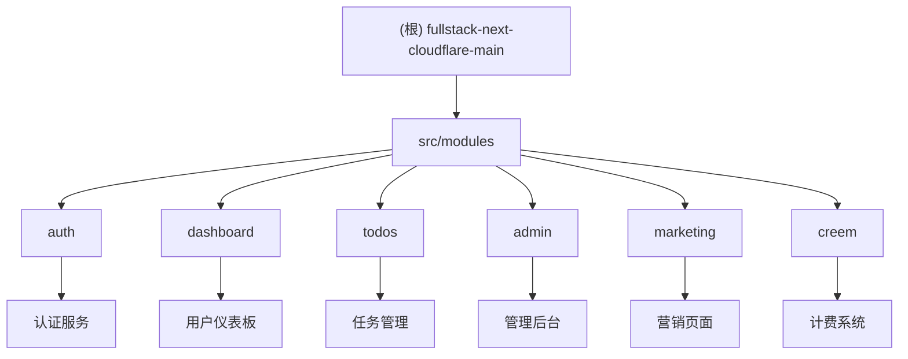

# CLAUDE.md - 项目AI上下文文档

> 基于 Next.js 15 + Cloudflare Workers 的全栈 SaaS 模板项目

## 项目愿景

这是一个现代化的全栈SaaS模板项目，采用以下核心技术栈：

- **前端框架**: Next.js 15 (App Router)
- **运行时**: Cloudflare Workers + OpenNext
- **数据库**: Cloudflare D1 (SQLite)
- **ORM**: Drizzle ORM
- **身份认证**: Better Auth + Google OAuth
- **UI**: Tailwind CSS + shadcn/ui
- **状态管理**: TanStack Query + React Hook Form
- **计费系统**: Creem Payment Integration

## 架构总览

### 运行时拓扑
```
浏览器 → Next.js App Router (Edge/SSR) → Server Actions / Route Handlers
          └─ Drizzle ORM → Cloudflare D1
          └─ R2 / Workers AI / 外部服务 (Creem)
          └─ 平台共享库 (认证、缓存、日志)
```

### 目录结构
- `src/app/` - App Router 入口：页面、布局、API 路由
- `src/modules/<feature>/` - 领域模块（actions/components/hooks/models/schemas/utils）
- `src/components/` - 共享UI组件（包括 shadcn/ui）
- `src/lib/` - 平台助手：CF绑定、日志、缓存、HTTP、SEO、i18n
- `src/db/` - Drizzle schema 和查询助手
- `src/drizzle/` - 数据库迁移文件
- `src/services/` - 跨域服务
- `scripts/` - 构建/i18n/工具脚本

### 数据层
- **用户认证**: `user`, `account`, `session`, `verification` 表
- **任务管理**: `todos`, `categories` 表
- **计费系统**: `customers`, `subscriptions`, `credits_history` 表
- **管理扩展**: 系统审计、站点设置、报表数据表

## ✨ 模块结构图



## 模块索引

| 模块路径 | 职责描述 | 技术栈 | 入口文件 | 质量保障 |
|---------|---------|--------|---------|----------|
| `src/modules/auth` | 身份认证与授权 | Better Auth, Google OAuth | `auth.action.ts` | 人工验收 |
| `src/modules/dashboard` | 用户主仪表板布局 | Next.js Layout, TanStack Query | `dashboard.layout.tsx` | 人工验收 |
| `src/modules/todos` | 任务管理系统 | Drizzle ORM, Zod, Server Actions | `todo.service.ts` | 人工验收 |
| `src/modules/admin` | 管理后台系统 | Refine, Drizzle, 多功能面板 | `admin.layout.tsx` | ⚠️ 部分覆盖 |
| `src/modules/marketing` | 营销落地页 | Next.js, SEO优化, i18n | `landing.page.tsx` | 人工验收 |
| `src/modules/creem` | 计费与订阅系统 | Creem API, Webhook处理 | `billing.service.ts` | 人工验收 |

## 运行与开发

### 本地开发
```bash
# Node.js 环境
pnpm dev

# Cloudflare Workers 环境
pnpm dev:cf

# 远程 Workers 开发
pnpm dev:remote
```

### 数据库操作
```bash
# 生成迁移
pnpm db:generate

# 本地迁移
pnpm db:migrate:local

# 生产环境迁移
pnpm db:migrate:prod

# 数据库可视化
pnpm db:studio
```

### 构建与部署
```bash
# 构建
pnpm build

# Cloudflare 构建
pnpm build:cf

# 部署
pnpm deploy:cf
```

### 代码质量
```bash
# 代码检查与格式化
pnpm exec biome check
pnpm exec biome apply

# 类型检查
pnpm typecheck

# 手工验收记录
# - 保持 PR 中的截图与回归清单
```

## 测试策略

仓库已移除自动化测试框架，质量保障依赖类型检查、文档一致性以及 PR 手工验收。请在提交前更新回归清单，附上关键路径的截图或录屏，并通过 `/api/v1/health` 进行部署后探活。详见 `docs/testing-status.md`。

## 编码规范

### 代码风格
- 使用 **Biome** 进行代码格式化和检查
- TypeScript 严格模式
- ES6+ 语法特性
- 函数式编程优先

### 命名约定
- **文件命名**: kebab-case（如：`user-profile.tsx`）
- **组件命名**: PascalCase（如：`UserProfile`）
- **函数/变量**: camelCase（如：`getUserById`）
- **常量**: UPPER_SNAKE_CASE（如：`API_BASE_URL`）

### 目录结构约定
```
src/modules/[feature]/
├── components/          # UI组件
├── actions/            # Server Actions
├── services/           # 业务逻辑服务
├── schemas/            # Zod验证模式
├── models/             # 类型定义
├── utils/              # 工具函数
├── hooks/              # React Hooks
└── __tests__/          # 已移除（无自动化测试）
```

### 数据库约定
- 使用 **Drizzle ORM** 进行类型安全的数据库操作
- 所有表必须包含 `created_at` 和 `updated_at` 字段
- 使用软删除而非物理删除
- 外键约束保持数据一致性

## AI 使用指引

### 开发助手角色
当进行AI辅助开发时，请遵循以下指导：

1. **架构理解**: 深入理解 Next.js 15 App Router 和 Cloudflare Workers 的结合使用
2. **类型安全**: 充分利用 TypeScript 和 Zod 的类型推导
3. **性能优化**: 考虑 Edge Runtime 的限制和优化策略
4. **安全实践**: 遵循 Better Auth 的安全模式和最佳实践

### 常见开发模式

#### Server Actions 模式
```typescript
"use server";

import { z } from "zod";
import { createTodoSchema } from "./schemas/todo.schema";

export async function createTodo(input: z.infer<typeof createTodoSchema>) {
  // 验证输入
  const validated = createTodoSchema.parse(input);

  // 调用服务层
  return await todoService.create(validated);
}
```

#### 服务层模式
```typescript
export async function listTodosForUser(
  userId: string,
  pagination: PaginationParams
): Promise<{ data: TodoWithCategory[]; total: number }> {
  const db = await getDb();
  // 数据库查询逻辑
}
```

#### API路由模式
```typescript
export async function GET(request: Request) {
  try {
    const session = await getSession();
    if (!session) return NextResponse.json({ error: "Unauthorized" }, { status: 401 });

    const data = await service.getData(session.user.id);
    return NextResponse.json(data);
  } catch (error) {
    return NextResponse.json({ error: "Internal Server Error" }, { status: 500 });
  }
}
```

## 环境配置

### 必需的环境变量
```bash
# Better Auth
BETTER_AUTH_SECRET=
BETTER_AUTH_URL=

# Google OAuth
GOOGLE_CLIENT_ID=
GOOGLE_CLIENT_SECRET=

# Cloudflare
D1_DATABASE_NAME=
R2_BUCKET_NAME=

# Creem Payment
CREEM_SECRET_KEY=
CREEM_WEBHOOK_SECRET=

# Upstash Redis (可选)
UPSTASH_REDIS_REST_URL=
UPSTASH_REDIS_REST_TOKEN=
```

### 数据库配置
- **本地**: `.dev.vars` 配置本地 D1 数据库
- **生产**: 通过 `wrangler secret put` 设置生产环境变量

## API 设计原则

### RESTful API 设计
- 使用标准 HTTP 方法（GET, POST, PUT, DELETE）
- 统一的错误响应格式
- 适当的 HTTP 状态码
- API 版本控制策略

### Server Actions 优先
- 对于表单提交和用户交互，优先使用 Server Actions
- 减少客户端复杂度
- 更好的类型安全性

### 错误处理
```typescript
// 统一错误响应格式
interface ApiResponse<T = any> {
  success: boolean;
  data?: T;
  error?: {
    code: string;
    message: string;
    details?: any;
  };
}
```

## 部署与监控

### Cloudflare 部署流程
1. 代码推送至 main 分支
2. GitHub Actions 自动构建
3. OpenNext 构建优化
4. Wrangler 部署到 Cloudflare Workers
5. 健康检查验证

### 监控与日志
- **健康检查**: `/api/v1/health` 端点（支持 `/api/health` 重定向）
- **审计日志**: 系统操作记录
- **错误追踪**: 集成错误监控服务
- **性能监控**: Workers Analytics

## 扩展指南

### 添加新功能模块
1. 在 `src/modules/` 下创建新模块目录
2. 按照标准目录结构组织代码
3. 更新人工验收清单
4. 更新路由配置
5. 编写模块文档

### 数据库迁移
```bash
# 生成新迁移
pnpm db:generate:named add_new_feature

# 应用迁移
pnpm db:migrate:local
```

### 添加新的API端点
1. 在 `src/app/api/` 下创建路由文件
2. 实现标准的错误处理
3. 添加适当的认证中间件
4. 记录关键路径验证步骤

## 故障排除

### 常见问题
1. **D1 连接问题**: 检查 wrangler.toml 配置
2. **认证失败**: 验证 Better Auth 配置
3. **构建错误**: 检查 TypeScript 类型定义
4. **部署失败**: 检查环境变量设置

### 调试技巧
- 使用 `console.log` 在 Workers 环境中调试
- 检查 `wrangler dev` 输出
- 使用 Chrome DevTools 调试客户端代码

---

## 变更记录 (Changelog)

### 2025-10-21 - 文档一致性更新
- ✅ 修复健康检查端点描述（添加 `/api/v1/health` 说明）
- ✅ 更新测试策略说明，引用 `docs/testing-status.md`
- ✅ 发现并记录额外模块（billing、openapi）
- ✅ 识别模块文档中的测试声明不一致问题

### 2025-10-16 01:48:57 - AI上下文初始化
- ✅ 创建根级 CLAUDE.md 文档
- ✅ 生成 Mermaid 模块结构图
- ✅ 建立模块索引表格
- ✅ 定义编码规范和最佳实践
- 📋 待完成：模块级文档生成中...

### 下一步计划
- [ ] 为每个模块生成详细的 CLAUDE.md 文档
- [ ] 补充缺失的验收检查
- [ ] 完善 API 文档
- [ ] 添加更多开发示例和模板

---

*此文档由AI自动生成，请根据实际项目变化及时更新。*
