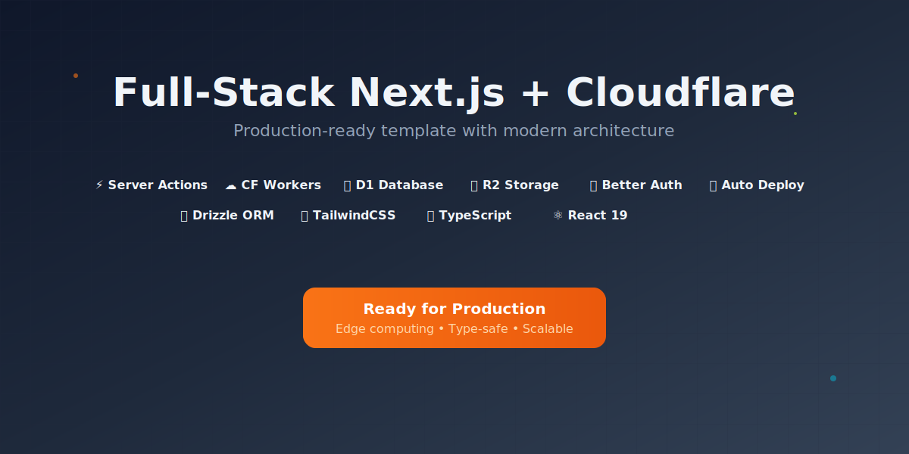

# Full-Stack Next.js + Cloudflare Template

  

Production-ready template for building full-stack applications on **Next.js 15 + Cloudflare Workers**. Covers D1, R2, Workers AI, authentication, CI/CD, automatic healing, and health checks so teams can scale from MVP to enterprise with edge-first performance.

---

## TL;DR（5 分钟跑起来）
1. `pnpm install`
2. `cp .dev.vars.example .dev.vars` 并补齐 Cloudflare / Auth 配置
3. `pnpm dev`
4. 打开 `http://localhost:3000`

需要预览或生产部署？前往 Actions 触发 `Deploy` 工作流，或执行 `pnpm deploy:preview` / `pnpm deploy:cf`。使用 `gh run watch` 跟踪 CI 状态。

---

## 核心特性
- **Edge 原生体验**：OpenNext 构建，部署到 Cloudflare Workers（300+ PoP）
- **数据库 + 存储**：Cloudflare D1 + R2，使用 Drizzle ORM 封装
- **CI/CD 套件**：Biome Lint、Vitest（规划中）、自动预览与生产发布
- **自动修复 & 合并**：`auto-fix` + `auto-merge-lite` 工作流支持白名单滚动 PR
- **健康检查**：`/api/health` fast/strict 模式，部署前自动验证
- **Observability**：Workers Analytics、可选 Sentry、日志聚合
- **国际化与 AI 翻译**：内置多语言与 Gemini/OpenAI 翻译脚本

---

## 快速指南

### 本地开发
- `pnpm dev`：Node runtime 快速迭代
- `pnpm dev:cf`：OpenNext + Wrangler，模拟 Workers 行为
- `pnpm lint` / `pnpm test`：提交前质量门（测试正在补齐）
- 详细调试说明见 [`docs/local-dev.md`](docs/local-dev.md)

### 预览部署
1. 在 GitHub Secrets 中配置 `CLOUDFLARE_API_TOKEN`、`CLOUDFLARE_ACCOUNT_ID`、`BETTER_AUTH_SECRET` 等凭据
2. 运行 `Deploy` 工作流或执行 `pnpm deploy:preview`
3. 使用 `gh run watch --exit-status` 跟踪结果

### 生产部署
- 默认由 `main` 分支 push 触发 `Deploy` 工作流
- 自动执行：构建 → 迁移 → 健康检查（`/api/health?fast=1`）→ 发布
- 失败会触发回滚与通知，详见 [`docs/deployment/cloudflare-workers.md`](docs/deployment/cloudflare-workers.md)

---

## 架构一览
- **App Router**：组织在 `src/app`，按 `(segment)` 切分权限域
- **业务模块**：`src/modules/<feature>` 提供 actions/components/services 等分层
- **数据访问**：`src/db` + `src/drizzle` 维护 Schema 与迁移
- **共享能力**：`src/lib` 封装 Cloudflare binding、日志、缓存等工具
- **更多详情**：参阅 [`docs/architecture-overview.md`](docs/architecture-overview.md)

---

## 文档地图
| 主题 | 文档 |
| --- | --- |
| 快速开始 | [`docs/getting-started.md`](docs/getting-started.md) |
| 本地调试 | [`docs/local-dev.md`](docs/local-dev.md) |
| 环境/密钥矩阵 | [`docs/env-and-secrets.md`](docs/env-and-secrets.md) |
| 测试策略 | [`docs/testing.md`](docs/testing.md) |
| 部署流程 | [`docs/deployment/cloudflare-workers.md`](docs/deployment/cloudflare-workers.md) |
| CI/CD | [`docs/ci-cd.md`](docs/ci-cd.md)（M3-M4 补齐） |
| 观察性与健康 | [`docs/health-and-observability.md`](docs/health-and-observability.md) |
| 故障排查 | [`docs/troubleshooting.md`](docs/troubleshooting.md) |
| 贡献规范 | [`docs/contributing.md`](docs/contributing.md) |
| 全量索引 | [`docs/00-index.md`](docs/00-index.md) |

---

## 自动化与 DevOps
- `.github/workflows/ci.yml`：Biome、TypeScript、（预留）Vitest
- `.github/workflows/deploy.yml`：预览 / 生产部署流水线，包含数据库迁移、健康检查
- `.github/workflows/auto-fix.yml`：针对白名单文件自动创建修复 PR
- `.github/workflows/auto-merge-lite.yml`：满足条件自动合并
- `.github/workflows/ops-notify.yml`：失败/恢复时通知并维护 Tracker Issue

更多细节及权限矩阵，请查看 [`docs/ci-cd.md`](docs/ci-cd.md) 与 `docs/workflows/*.md`（按里程碑逐步完善）。

---

## 贡献 & 社区
- 遵循 TypeScript、PascalCase 组件、Biome 风格
- 贡献流程、PR 模板、测试要求：见 [`docs/contributing.md`](docs/contributing.md)
- 若修改 Cloudflare 绑定或工作流，务必同步更新相关文档并在 PR 描述中说明

欢迎 Issues / PR，并使用 `gh run watch` 附上 CI 结果，方便 Reviewer 快速验证。

---

## 许可证

MIT © 2025 Muhammad Arifin
