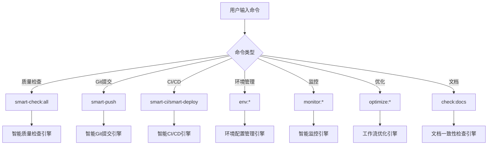
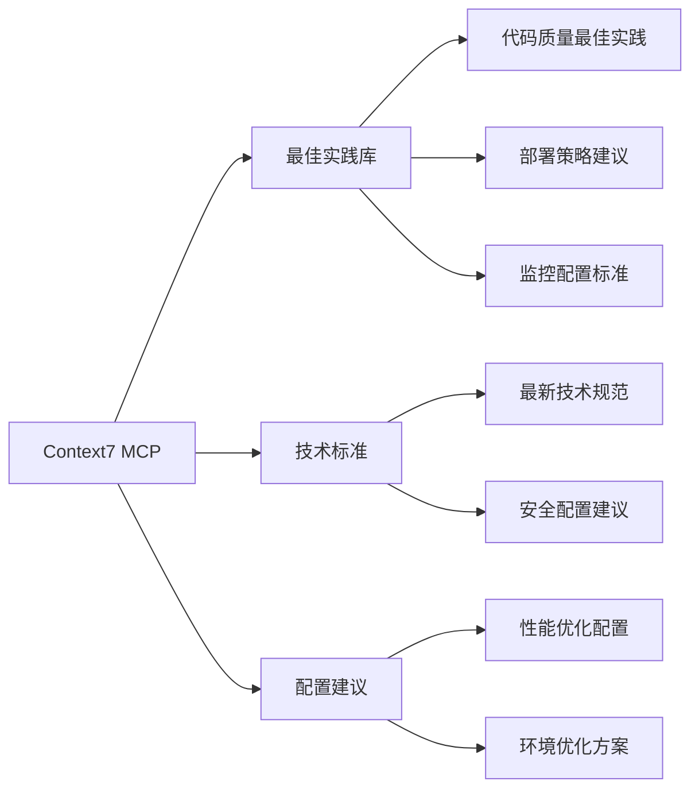
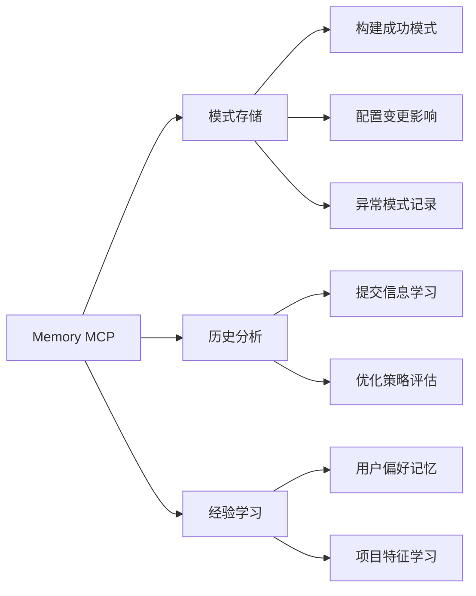
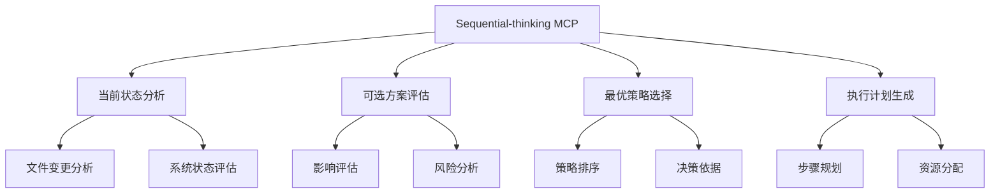
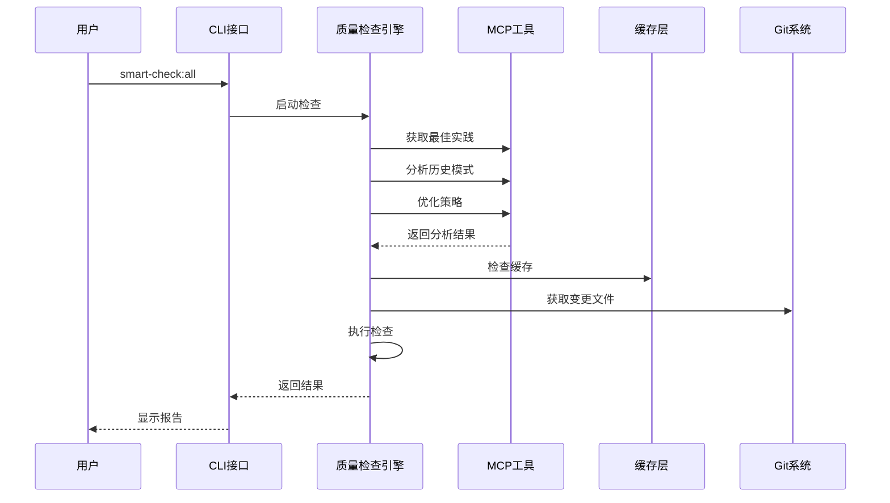
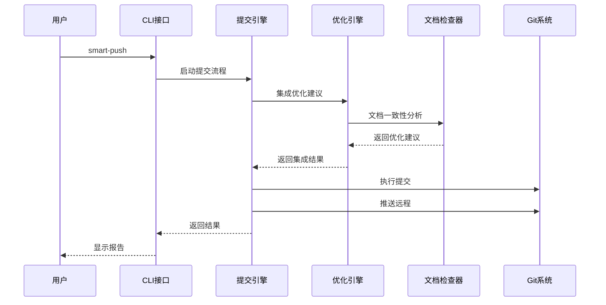
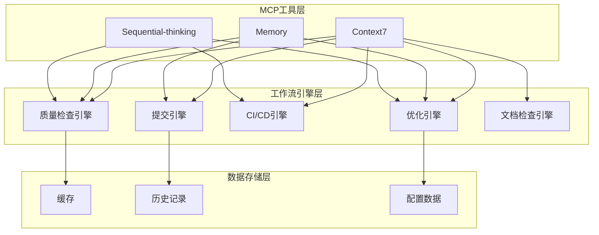

# 智能化DevOps系统 - 系统架构

> 🏗️ 完整的智能化DevOps工作流系统架构图和组件说明

## 📋 系统架构概览

```
智能化DevOps系统
├── 🎯 用户交互层
│   ├── 命令行接口 (CLI Commands)
│   ├── 配置管理 (Environment Variables)
│   └── 报告输出 (Reports & Dashboards)
│
├── 🧠 MCP工具集成层
│   ├── Context7 (最佳实践获取)
│   ├── Memory (模式学习与记忆)
│   └── Sequential-thinking (智能决策)
│
├── 🔧 核心工作流引擎
│   ├── 智能质量检查引擎
│   ├── 智能Git提交引擎
│   ├── 智能CI/CD引擎
│   ├── 环境配置管理引擎
│   ├── 智能监控引擎
│   ├── 工作流优化引擎
│   └── 文档一致性检查引擎
│
├── 📊 数据层
│   ├── 检查结果缓存
│   ├── 优化历史记录
│   ├── 系统配置数据
│   └── 监控指标存储
│
└── 🔄 外部集成层
    ├── Git 仓库
    ├── GitHub Actions
    ├── Cloudflare Workers
    ├── 监控服务
    └── 文档系统
```

## 🎯 核心组件详解

### 1. 用户交互层

#### CLI命令接口


#### 配置管理
- **环境变量**: ENABLE_MCP, STRICT_MODE, AUTO_COMMIT等
- **质量门禁流程**: 通过 `pnpm push` 本地自检与 CI 工作流共享的质量闸执行，详见 `docs/quality-gates.md`
- **动态配置**: 运行时配置调整

### 2. MCP工具集成层

#### Context7集成


#### Memory集成


#### Sequential-thinking集成


### 3. 核心工作流引擎

#### 智能质量检查引擎
```
SmartQualitySession
├── 初始化 (initialize)
├── 变更分析 (analyzeChanges)
│   ├── 文件分类
│   ├── 风险评估
│   └── 策略选择
├── 智能执行 (executeSmartCheck)
│   ├── 并行任务调度
│   ├── MCP增强分析
│   └── 实时监控
└── 报告生成 (generateReport)
```

#### 智能Git提交引擎
```
SmartPushSession
├── 会话初始化
├── 提交信息生成
│   ├── 文件变更分析
│   ├── MCP模式匹配
│   └── Conventional Commits生成
├── 质量检查集成
├── 冲突检测
├── 优化建议集成
├── 自动提交
└── 推送同步
```

#### 工作流优化引擎
```
WorkflowOptimizer
├── 优化机会分析
│   ├── 检查结果分析
│   ├── 文档一致性检查
│   └── MCP增强分析
├── 优先级排序
├── 集成计划生成
├── 自动优化应用
└── 建议输出
```

## 🔄 数据流架构

### 检查流程数据流


### 提交流程数据流


## 📊 组件交互关系

### MCP工具交互图


## 🔧 配置和扩展

### 质量门禁流程

- `pnpm push`：在开发者本地串行执行类型检查、单测（含覆盖率）、文档与链接校验以及 Biome 格式化。
- CI `smart-check` 作业：拉取分支后复用相同的检查清单，并附加构建与部署前置验证。
- 可通过环境变量（如 `SKIP_TESTS=1 pnpm push`）或 `docs/quality-gates.md` 中列出的开关临时调整门禁范围。

### 环境配置结构
```
config/environments/
├── base.json (基础配置)
├── development.json (开发环境)
├── staging.json (预发布环境)
└── production.json (生产环境)
```

### 系统配置
```
.env (环境变量)
├── ENABLE_MCP (MCP开关)
├── STRICT_MODE (严格模式)
├── AUTO_COMMIT (自动提交)
└── SKIP_* (跳过选项)
```

## 🚀 执行模式

### 1. 开发模式
- **目标**: 快速反馈，开发效率
- **特性**: 增量检查，快速验证
- **命令**: `smart-check:all`, `smart-push`

### 2. 发布模式
- **目标**: 质量保证，稳定发布
- **特性**: 全面检查，严格验证
- **命令**: `smart-check:strict`, `smart-push:strict`

### 3. 维护模式
- **目标**: 系统优化，持续改进
- **特性**: 深度分析，优化建议
- **命令**: `optimize:all`, `monitor:health`

### 4. 调试模式
- **目标**: 问题诊断，详细分析
- **特性**: 详细日志，调试信息
- **配置**: `DEBUG=1`, `VERBOSE=1`

## 📈 性能特性

### 并行执行
- **检查任务**: 根据依赖关系并行执行
- **文件处理**: 按类型和大小并行处理
- **MCP调用**: 异步调用，减少等待时间

### 缓存机制
- **检查结果**: 缓存重复检查结果
- **MCP响应**: 缓存MCP工具响应
- **配置数据**: 缓存环境配置

### 智能调度
- **任务优先级**: 根据影响和紧急程度排序
- **资源分配**: 动态调整执行资源
- **负载均衡**: 分散系统负载

## 🛡️ 可靠性保障

### 降级策略
- **MCP故障**: 自动切换到本地算法
- **网络问题**: 使用缓存数据继续执行
- **系统错误**: 优雅降级，保证核心功能

### 错误恢复
- **重试机制**: 智能重试失败操作
- **回滚支持**: 自动回滚有问题的更改
- **状态恢复**: 系统崩溃后状态恢复

### 监控告警
- **健康检查**: 定期系统健康检查
- **性能监控**: 实时性能指标监控
- **异常检测**: 自动异常检测和告警

---

## 💡 使用建议

1. **日常开发**: 使用 `smart-check:all` + `smart-push`
2. **发布前**: 使用 `smart-check:strict` + `smart-push:strict`
3. **定期维护**: 使用 `optimize:all` + `check:docs:mcp`
4. **问题诊断**: 启用 `DEBUG=1` 获取详细信息

*整个系统设计为模块化、可扩展的架构，支持根据项目需求进行定制和扩展。*