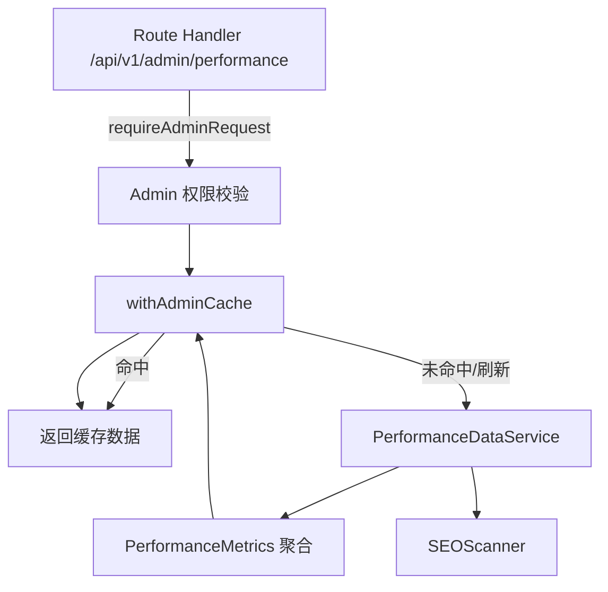

# Admin Performance 模块说明

> 适用范围：`src/modules/admin/performance`、`src/modules/admin/services/performance-data.service.ts`、`src/modules/admin/services/seo-scanner.ts` 及相关组件。

## 功能概览

Admin Performance 子模块面向管理后台提供端到端的站点可观测性能力，包括：

- 汇总 Core Web Vitals、SEO 体检、系统健康等关键指标。
- 与 Cloudflare Workers 运行态的缓存、失效策略保持一致，支持多租户/时间范围筛选。
- 提供人工刷新、自动轮询等工具，帮助运营人员快速发现性能回归。

该模块在导航栏位于“系统监控”分组下，默认进入 `/admin/performance` 总览页。

## 页面与路由

| 路由 | 页面文件 | 关键组件 | 描述 |
|------|----------|----------|------|
| `/admin/performance` | `performance/pages/performance-overview.page.tsx` | `SystemPerformanceOverview`、`PerformanceMonitor`、`SEOTechnicalDashboard` | 综合仪表盘，聚合性能评分、SEO 等级、问题计数，并提供外部工具快捷入口。 |
| `/admin/performance/web-vitals` | `performance/pages/web-vitals.page.tsx` | `WebVitalsDashboard` | Core Web Vitals 指标的趋势分析与阈值状态提示。 |
| `/admin/performance/seo` | `performance/pages/seo.page.tsx` | `SEOTechnicalDashboard`、`PerformanceMonitor` | SEO 检查结果展示，包含问题分类、建议与评分。 |
| `/admin/performance/system-health` | `performance/pages/system-health.page.tsx` | `SystemPerformanceOverview` | 展示 Workers 运行、数据库延迟、缓存命中率等平台层健康状况。 |

所有路由均由 `routes/admin.routes.ts` 公开，供页面和面包屑组件引用。

## 组件清单

| 组件 | 位置 | 职责 |
|------|------|------|
| `PerformanceMonitor` | `src/modules/admin/components/performance-monitor.tsx` | 轮询缓存统计和失效事件，展示命中率、响应时间并支持自动刷新。 |
| `SystemPerformanceOverview` | `src/modules/admin/components/system-performance-overview.tsx` | 汇总系统健康分数、可用性、错误率等数据，渲染于概览与系统健康页面。 |
| `WebVitalsDashboard` | `src/modules/admin/components/web-vitals-dashboard.tsx` | 可视化 LCP、INP、CLS、FCP、TTFB 等指标曲线和历史数据。 |
| `SEOTechnicalDashboard` | `src/modules/admin/components/seo-technical-dashboard.tsx` | 展示 SEO 扫描的检查项、建议与等级。 |

## 服务与数据流

- `src/app/api/v1/admin/performance/route.ts` 提供 `GET` 与 `POST` 两个 handler：
  - `GET`：接收 `timeframe`、`metrics`、`tenantId` 查询参数，经 `withAdminCache` 包装后返回聚合指标，并在 `meta` 中标记缓存命中与响应时间。
  - `POST`：绕过缓存获取最新数据，并强制写回缓存，用于手动刷新仪表盘。
- `PerformanceDataService`（`services/performance-data.service.ts`）负责将 Web Vitals、SEO 与系统健康数据组装成统一的 `PerformanceMetricsSchema`，并维护 30 秒内存缓存。
- `SEOScanner`（`services/seo-scanner.ts`）提供页面抓取、阈值校验与建议生成，被服务层按需调用。

## 关键数据结构

- `PerformanceMetricsSchema`：综合指标结构，含 `overview`、`webVitals`、`seo`、`systemHealth`、`quickStats` 字段。对外暴露的类型为 `PerformanceMetrics`。
- `SEOCheckResultSchema`：SEO 扫描结果，包含每个检查项的状态、问题与建议列表。
- 所有 Schema 均基于 Zod，确保 API 响应与前端消费数据的一致性。

## 开发提示

1. **新增指标**：在 `PerformanceDataService` 中扩展 Schema 与计算逻辑，同时更新相关组件的渲染分支。
2. **调整缓存策略**：修改 `PerformanceDataService` 的 `CACHE_TTL` 或 API 层的 `withAdminCache` 自定义 TTL，确保仪表盘刷新频率与后端负载平衡。
3. **集成外部监控**：可在 `performance-overview.page.tsx` 的操作区新增外部链接或按钮，也可在 `PerformanceMonitor` 内调用实际的监控服务 SDK。

---

如需补充路由示例或错误处理策略，请在此文档追加章节，并在 `src/modules/admin/CLAUDE.md` 的性能监控条目中保持链接更新。
